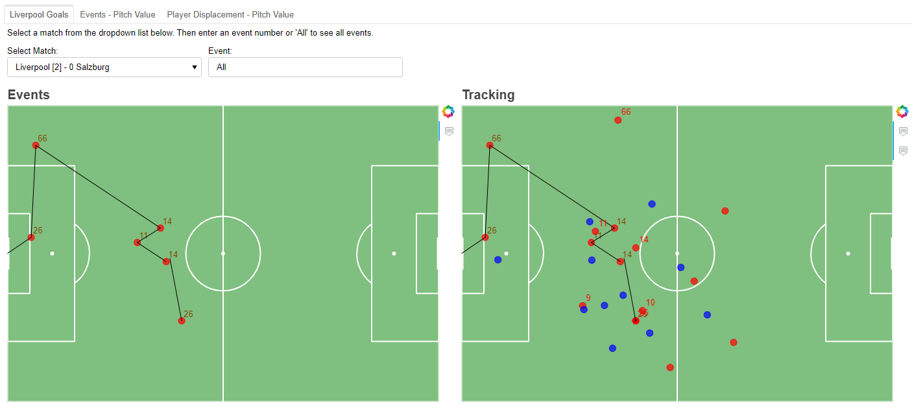
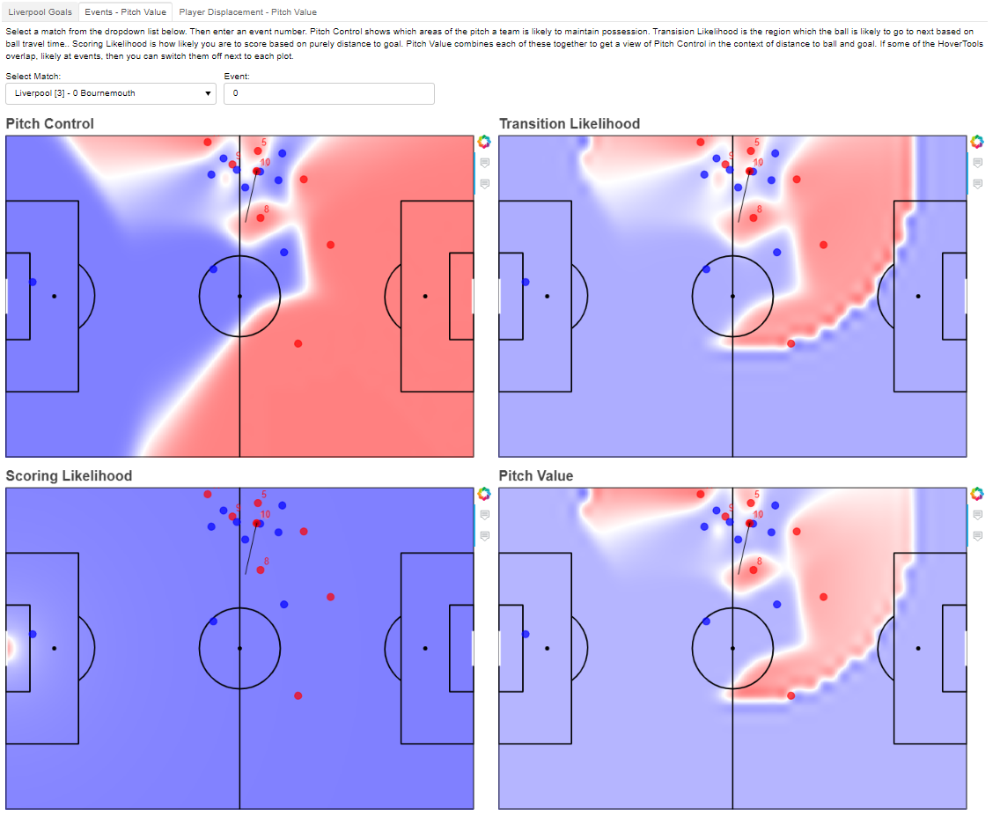
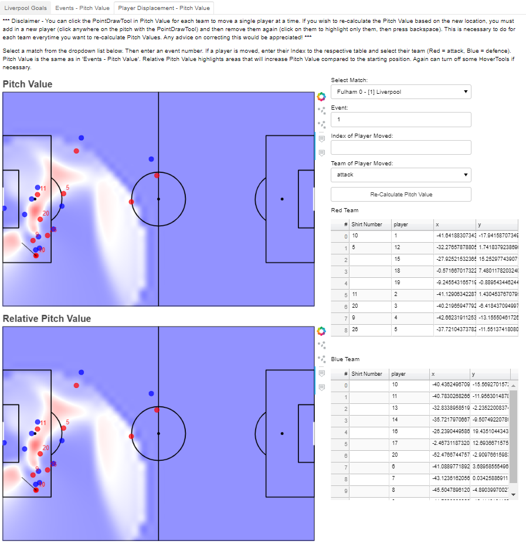

# bokeh-liverpool-goals

** Update - links for separate tabs **

https://bokeh-liverpool-tab1.herokuapp.com/ - all games available.

https://bokeh-liverpool-tab2.herokuapp.com/ - only two games loaded in here.

https://bokeh-liverpool-tab3.herokuapp.com/ - may need to reload this a few times as gets close to 30 second timeout with a single game.

If wanting a quicker app with all goals, would still recommend running from own bokeh server as below.
**

This is a bokeh dashboard using [@lastrowview](https://twitter.com/lastrowview)'s tracking data for several Liverpool goals.
The data can be found on their GitHub page here: 
[https://github.com/Friends-of-Tracking-Data-FoTD/Last-Row]

The Friends of Tracking tutorials and videos helped set up the majority of the functions and background.
Especially Laurie's [@EightyFivePoint](https://twitter.com/EightyFivePoint) Metrica data lessons: 
[https://github.com/Friends-of-Tracking-Data-FoTD/LaurieOnTracking]

Initail plots for the pitch came in handy from [@danzn1](https://twitter.com/danzn1) here: 
[https://github.com/znstrider/PyFootballPitch]

The dashboard makes use of bokeh's server. To run the app, download the `bokeh-app` folder to your cd and using command line enter:
  ```
  bokeh serve --show bokeh-app
  ```
1. bokeh serve - this opens a server connection
2. --show - this opens the app in a browser
3. bokeh-app - this is the name of the folder which contains main.py (where the magic happens)

Have attempted to host this app on its own URL via binder and heroku, however just seem to get a white screen. If anyone has any advice please let me know! -- See update, added each tab to individual heroku links

heroku tabs are here:
https://github.com/ciaran-grant/bokeh-liverpool-tab1

https://github.com/ciaran-grant/bokeh-liverpool-tab2

https://github.com/ciaran-grant/bokeh-liverpool-tab3

Here's my binder attempt if interested:
[https://github.com/ciaran-grant/bokeh-binder]


## Preview:

### Tab1: Event and Tracking Overview



### Tab2: Calculating Pitch Value



### Tab3: Updating Pitch Value from Player Displacement
*** Disclaimer - this will take a few seconds 'thinking' to change between matches and events ***
Please do read the disclaimer within the app with regards to how the recalculate function works. Didn't want to make a disclaimer to read another disclaimer...




